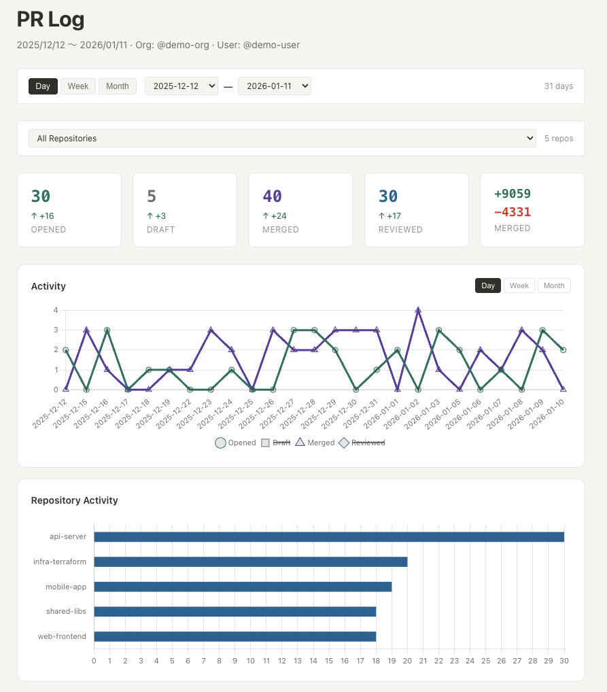

# shiraberu

[](https://github.com/taikicoco/shiraberu/actions/workflows/ci.yml)
[](https://pkg.go.dev/github.com/taikicoco/shiraberu)

A CLI tool to track and report your GitHub PR contributions within an organization.

## Demo

<p align="center">
  
</p>

## Features

- Display PRs you opened, merged, or reviewed by day
- Separate Draft PRs from regular PRs
- Show code changes (additions/deletions) and comment counts
- Support for HTML, Markdown, and browser output
- Fast data fetching via GitHub GraphQL API

## Requirements

- Go 1.24+
- [GitHub CLI](https://cli.github.com/) (`gh`) - authenticated

## Installation

```bash
go install github.com/taikicoco/shiraberu@latest
```

## Usage
```
shiraberu
```
[godoc](https://pkg.go.dev/github.com/taikicoco/shiraberu)
